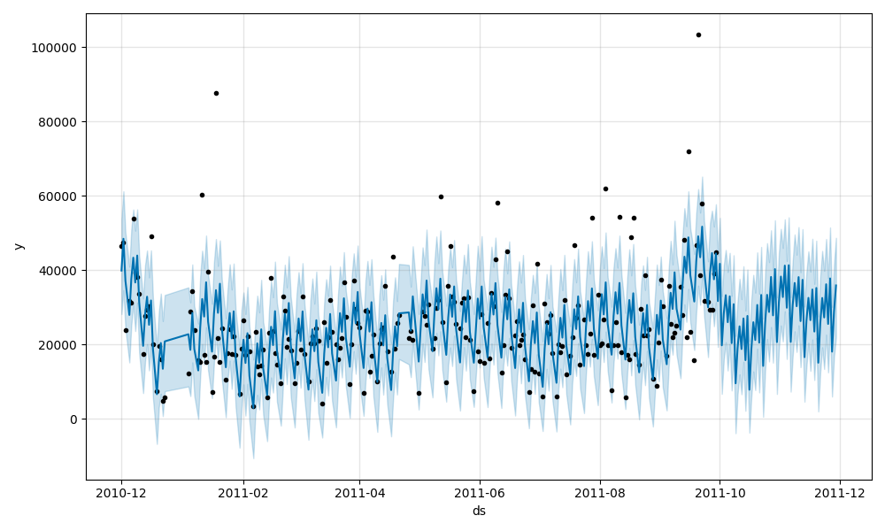
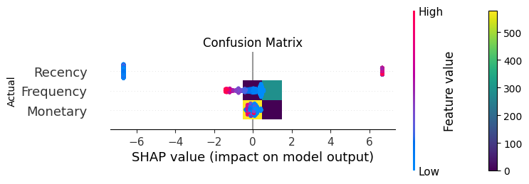

# Enterprise Retail Intelligence Platform with Advanced ML & MLOps


A production-style retail intelligence platform implementing advanced machine learning, forecasting systems, customer analytics, and MLOps pipelines using Python, MLflow, FastAPI, Streamlit, and Docker.

---

# 🚀 Features

- Automated ETL pipelines
- Data quality validation
- Advanced feature engineering
- Customer segmentation
- Customer churn prediction
- Demand forecasting using LSTM & Prophet
- Ensemble forecasting system
- Price elasticity modeling
- Hyperparameter tuning using Optuna
- SHAP explainability
- MLflow experiment tracking
- MLflow model registry
- Weekly automated model reports
- FastAPI inference APIs
- Streamlit business dashboards
- Airflow orchestration
- Dockerized infrastructure

---

# 🧱 Architecture

```text
Data Sources
    ↓
Ingestion Pipeline
    ↓
Bronze Layer
    ↓
Silver Layer
    ↓
Feature Engineering
    ↓
ML Models
    ↓
MLflow Tracking
    ↓
Model Registry
    ↓
FastAPI APIs
    ↓
Streamlit Dashboard
```

---

# 🛠️ Tech Stack

- Python
- Pandas
- NumPy
- Scikit-learn
- XGBoost
- LightGBM
- Prophet
- PyTorch
- MLflow
- Optuna
- SHAP
- FastAPI
- Streamlit
- PostgreSQL
- Redis
- Docker
- Apache Airflow

---

# 📂 Project Structure

```text
retail-analytics-platform/
│
├── artifacts/
│   ├── elasticity/
│   ├── ensemble/
│   ├── forecasting/
│   ├── models/
│   ├── plots/
│   ├── predictions/
│   ├── segmentation/
│   ├── shap/
│   └── stacking/
│
├── data/
├── notebooks/
│
├── src/
│   ├── api/
│   ├── dashboard/
│   ├── data/
│   ├── features/
│   ├── models/
│   ├── pipelines/
│   └── reports/
│
├── tests/
├── docker/
├── airflow/
├── pyproject.toml
└── README.md
```

---

# 🤖 Machine Learning Models

## Forecasting
- LSTM Forecasting
- Prophet Forecasting
- Ensemble Forecasting

## Classification
- XGBoost Churn Prediction
- LightGBM Churn Prediction
- Stacking Ensemble Classifier

## Customer Analytics
- Customer Segmentation
- RFM Analysis
- Price Elasticity Modeling

## MLOps
- MLflow Tracking
- Model Registry
- Automated Reporting
- Experiment Logging

## Explainable AI
- SHAP Feature Importance
- SHAP Summary Visualization

---

# 📈 Model Performance

| Model | Metric | Score |
|---|---|---|
| LSTM Forecasting | MAPE | 0.4051 |
| Prophet Forecasting | MAPE | 0.4498 |
| Ensemble Forecasting | MAPE | 0.4275 |
| XGBoost Churn | AUC | 1.0000 |
| LightGBM Churn | AUC | 1.0000 |
| Customer Segmentation | Silhouette Score | 0.8958 |
| Price Elasticity | R² | 0.1655 |

---

# 📊 Visualization & Analytics

- Interactive Streamlit Dashboard
- KPI Monitoring
- Sales Trend Analytics
- Forecast Visualizations
- Customer Segmentation Insights
- Revenue Analysis
- SHAP Explainability Plots

---

# ⚡ Serving & APIs

- FastAPI Prediction APIs
- Swagger Documentation
- Real-time Inference
- Batch Prediction Support

---

# 🐳 Infrastructure & MLOps

- Docker Compose Setup
- MLflow Tracking Server
- Model Registry
- PostgreSQL Database
- Redis Cache
- Apache Airflow Orchestration
- Automated Reporting Pipelines
- Git Hooks with Ruff & Black

---

# 📸 Screenshots

## MLflow Dashboard


## Streamlit Dashboard


## Forecasting Output


## SHAP Explainability


---

# ▶️ Run Project

## 1️⃣ Install Dependencies

```bash
poetry install
```

---

## 2️⃣ Run MLflow

```bash
poetry run mlflow ui
```

MLflow UI:
http://127.0.0.1:5000

---

## 3️⃣ Run FastAPI

```bash
poetry run uvicorn src.api.main:app --reload
```

FastAPI Docs:
http://127.0.0.1:8000/docs

---

## 4️⃣ Run Streamlit Dashboard

```bash
poetry run streamlit run src/dashboard/app.py
```

---

## 5️⃣ Run Airflow

```bash
airflow standalone
```

---

# 🧪 Example ML Pipelines

## Run Prophet Forecasting

```bash
poetry run python src/models/prophet_forecasting.py
```

## Run Ensemble Forecasting

```bash
poetry run python src/models/ensemble_forecasting.py
```

## Run Stacking Churn Model

```bash
poetry run python src/models/stacking_churn_model.py
```

## Run Weekly Model Report

```bash
poetry run python src/reports/weekly_model_report.py
```

---

# 🏷️ Current Release

`v2.0` — Advanced ML & MLOps Pipeline

---

# 🔮 Future Enhancements

- Real-time streaming pipelines
- Kubernetes deployment
- CI/CD automation
- Drift monitoring
- Recommendation systems
- Generative AI analytics assistant
- Cloud deployment (AWS/GCP/Azure)

---

# 👨‍💻 Author

**Santosh Kumar Neyyala**

- GitHub: https://github.com/SantoshKumarNeyyala

---

# ⭐ If You Like This Project

Give this repository a star and follow for future updates.